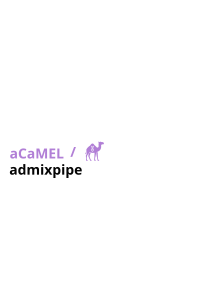
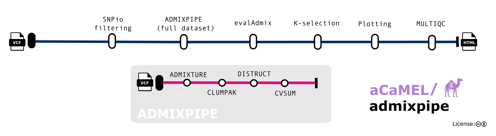

<h1>
  <picture>
    <source media="(prefers-color-scheme: dark)" srcset="docs/images/acamel_admixpipe_logo_dark.svg">
    
  </picture>
</h1>

[](https://github.com/UARK-aCaMEL/admixpipe/actions/workflows/ci.yml)
[](https://github.com/UARK-aCaMEL/admixpipe/actions/workflows/linting.yml)
[](https://doi.org/10.5281/zenodo.XXXXXXX)

[](https://www.nextflow.io/)
[](https://www.docker.com/)
[](https://sylabs.io/docs/)
[](https://cloud.seqera.io/launch?pipeline=https://github.com/UARK-aCaMEL/admixpipe)

## Introduction

**aCaMEL/admixpipe** is a bioinformatics pipeline that infers population structure from SNP data. It takes a multi-sample VCF and a population map, and runs replicate [ADMIXTURE](https://dalexander.github.io/admixture/) analyses across a range of K using [AdmixPipe](https://github.com/stevemussmann/admixturePipeline). Replicates are aligned, a best K is chosen and model fit is assessed. All results are collected into one interactive report, which also records the full command and every parameter used. If sampling-site coordinates are given, the report includes ancestry maps.



1. Filter SNPs and samples, and summarise missing data, F<sub>ST</sub> and PCA ([`SNPio`](https://github.com/btmartin721/SNPio))
2. Run ADMIXTURE for K = 1 to `--maxk`, with replicates and cross-validation ([`AdmixPipe`](https://github.com/stevemussmann/admixturePipeline), [`ADMIXTURE`](https://dalexander.github.io/admixture/), [`PLINK`](https://www.cog-genomics.org/plink/), [`VCFtools`](https://vcftools.github.io/))
3. Align replicates and find clustering modes ([`CLUMPAK`](https://clumpak.tau.ac.il/), [`CLUMPP`](https://rosenberglab.stanford.edu/clumpp.html), [`distruct`](https://rosenberglab.stanford.edu/distruct.html))
4. Choose the best K by cross-validation error, Evanno ΔK or log-likelihood ([`--bestk_method`](docs/usage.md#choosing-the-best-k))
5. Assess model fit ([`evalAdmix`](https://github.com/GenisGE/evalAdmix))
6. Map ancestry proportions per site (optional)
7. Build an interactive report ([`MultiQC`](http://multiqc.info/))

## Usage

> [!NOTE]
> If you are new to Nextflow, please refer to [this page](https://www.nextflow.io/docs/latest/install.html) on how to set it up. A container engine (Docker, Singularity/Apptainer or Podman) is required. Make sure to test your setup with `-profile test,docker` before running the workflow on actual data.

First, prepare a population map: a tab-delimited file with no header, giving each sample (as named in the VCF) and its population.

`popmap.tsv`:

```text
86NCCFE01	NCCFE
86NCCFE02	NCCFE
86NCCOT01	NCCOT
```

Now, you can run the pipeline using:

```bash
nextflow run UARK-aCaMEL/admixpipe \
   -profile <docker/singularity/.../institute> \
   --input genotypes.vcf.gz \
   --popmap popmap.tsv \
   --outdir <OUTDIR>
```

> [!WARNING]
> Please provide pipeline parameters via the CLI or Nextflow `-params-file` option. Custom config files including those provided by the `-c` Nextflow option can be used to provide any configuration _**except for parameters**_; see [docs](https://nf-co.re/docs/usage/getting_started/configuration#custom-configuration-files).

For more details and further functionality, please refer to the [usage documentation](docs/usage.md) and the [parameter documentation](nextflow_schema.json) (or run with `--help`).

## Pipeline output

The main output is an interactive report, `<OUTDIR>/report/multiqc_report.html`. For more details about the output files and reports, please refer to the [output documentation](docs/output.md).

## Credits

aCaMEL/admixpipe was originally written by [Tyler K. Chafin](https://github.com/tkchafin).

We thank the following people for their assistance in the development of this pipeline:

- [Steven M. Mussmann](https://github.com/stevemussmann), author of AdmixPipe
- [Bradley T. Martin](https://github.com/btmartin721), author of SNPio

## Contributions and Support

If you would like to contribute to this pipeline, please see the [contributing guidelines](.github/CONTRIBUTING.md). Bugs and questions can be reported on the [issue tracker](https://github.com/UARK-aCaMEL/admixpipe/issues).

## Citations

If you use aCaMEL/admixpipe for your analysis, please cite it using the following doi: [10.5281/zenodo.XXXXXXX](https://doi.org/10.5281/zenodo.XXXXXXX)

Please also cite the tools used by the pipeline:

- **ADMIXTURE**: Alexander DH, Novembre J, Lange K (2009). Fast model-based estimation of ancestry in unrelated individuals. _Genome Research_ 19:1655–1664. doi: [10.1101/gr.094052.109](https://doi.org/10.1101/gr.094052.109)
- **AdmixPipe**: Mussmann SM, Douglas MR, Chafin TK, Douglas ME (2020). AdmixPipe: population analyses in Admixture for non-model organisms. _BMC Bioinformatics_ 21:337. doi: [10.1186/s12859-020-03701-4](https://doi.org/10.1186/s12859-020-03701-4)
- **CLUMPAK**: Kopelman NM, Mayzel J, Jakobsson M, Rosenberg NA, Mayrose I (2015). Clumpak: a program for identifying clustering modes and packaging population structure inferences across K. _Molecular Ecology Resources_ 15:1179–1191. doi: [10.1111/1755-0998.12387](https://doi.org/10.1111/1755-0998.12387)
- **distruct**: Rosenberg NA (2004). distruct: a program for the graphical display of population structure. _Molecular Ecology Notes_ 4:137–138. doi: [10.1046/j.1471-8286.2003.00566.x](https://doi.org/10.1046/j.1471-8286.2003.00566.x)
- **evalAdmix**: Garcia-Erill G, Albrechtsen A (2020). Evaluation of model fit of inferred admixture proportions. _Molecular Ecology Resources_ 20:936–949. doi: [10.1111/1755-0998.13171](https://doi.org/10.1111/1755-0998.13171)
- **SNPio**: Martin BT, Monaco DR, Sharabi N, Mussmann SM, Chafin TK (2026). SNPio: a Python interface for population genomic data processing. _BMC Bioinformatics_. doi: [10.1186/s12859-026-06546-5](https://doi.org/10.1186/s12859-026-06546-5)

An extensive list of references for the tools used by the pipeline can be found in the [`CITATIONS.md`](CITATIONS.md) file. Each report also includes a methods paragraph and reference list for the tools used in that run.

This pipeline uses code and infrastructure developed and maintained by the [nf-core](https://nf-co.re) community, reused here under the [MIT license](https://github.com/nf-core/tools/blob/master/LICENSE).

> **The nf-core framework for community-curated bioinformatics pipelines.**
>
> Philip Ewels, Alexander Peltzer, Sven Fillinger, Harshil Patel, Johannes Alneberg, Andreas Wilm, Maxime Ulysse Garcia, Paolo Di Tommaso & Sven Nahnsen.
>
> _Nat Biotechnol._ 2020 Feb 13. doi: [10.1038/s41587-020-0439-x](https://dx.doi.org/10.1038/s41587-020-0439-x).
